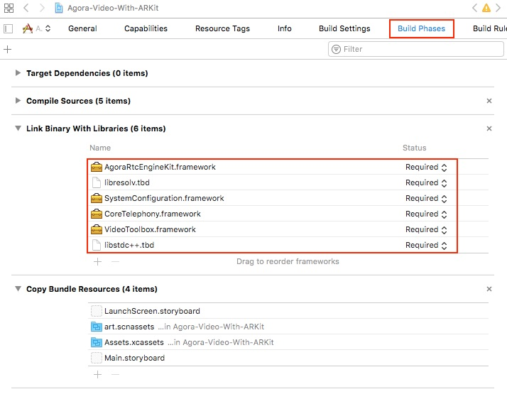

# Agora Video with ARKit

*Read this in other languages: [Chinese](README.zh.md)*

This quick start enables you to integrate live video chat functionality from the Agora Video SDK using an iOS ARKit sample application.

This sample application demonstrates the following basic Agora SDK functionality:

- Sending a captured ARFrame image to a live video channel
- Rendering remote user ARSession video frames as SCNNodes


## Prerequisites
- Agora.io developer account
- Xcode 9.0+
- Physical iPhone or iPad device (iOS simulator is not supported)

## Quick Start
This section shows you how to prepare and build the Agora Video with the ARKit sample app.

### Create an Account and Obtain an App ID
To build and run the sample application, first obtain an app ID: 

1. Create a developer account at [agora.io](https://dashboard.agora.io/signin/). Once you finish the sign-up process, you are redirected to the dashboard.
2. Navigate in the dashboard tree on the left to **Projects** > **Project List**.
3. Copy the app ID that you obtained from the dashboard into a text file. You will use this when you launch the app.

### Update and Run the Sample Application 

1. Open `Agora-Video-With-ARKit.xcodeproj` and edit the `ViewController.swift` file. In the `viewDidLoad` function, update `<#Your AppId#>` with your app ID.

   ``` Swift
   agoraKit = AgoraRtcEngineKit.sharedEngine(withAppId: <#Your App Id#>, delegate: self)
   ```

2. Download the [Agora Video SDK](https://docs.agora.io/en/Agora%20Platform/downloads). Unzip the downloaded SDK package and copy the `libs/AograRtcEngineKit.framework` file into the `Agora-Video-With-ARKit` folder.

	**Note:** Custom media device protocols are available in the Agora SDK 2.1.0.
		
3. Connect your iPhone／iPad device and run the project. Ensure a valid provisioning profile is applied or your project will not run.

### Using the Sample Application

This sample application requires two devices and works in conjunction with the [OpenLive](https://github.com/AgoraIO/OpenLive-iOS) sample application. 

1. Run the sample application. The device will display a flashing red plane indicator. Move the device until you find a horizontal surface.
 
2. Touch the plane indicator to add a virtual display screen to your AR session. The virtual display screen streams the video from the remote user.

3. On a different device, launch the [OpenLive](https://github.com/AgoraIO/OpenLive-iOS) sample application using the app ID and join the channel `agoraar` as a broadcaster. The virtual display screen from the previous step displays the video broadcast sent from this [OpenLive](https://github.com/AgoraIO/OpenLive-iOS) application.

	


## Steps to Create the Sample

The iOS ARKit sample application manages the Agora SDK and ARKit functionality through three main Swift files: [`ViewController`](#create-viewcontroller), [`ARVideoSource`](#create-arvideosource), and [`ARVideoRenderer`](#create-arvideorenderer).

- [Add Assets](#add-assets)
- [Create the Storyboard](#create-storyboard)
- [Add Frameworks](#add-frameworks)
- [Create the ViewController](#create-viewcontroller)
- [Create the ARVideoSource](#create-arvideosource)
- [Create the ARVideoRenderer](#create-arvideorenderer)

### Add Assets

Create a folder named `art.scnassets` and add the `displayer.scn` scene file. The scene in `displayer.scn` contains a rectangular plane, which is used to display the video.


### Create the Storyboard

Open the `main.storyboard` file in XCode's **Interface Builder**.

1. Add an `ARSCNView` object to the stage. This will be the main view for the ARKit application. 

	**Note:** This `ARSCNView` connects to the `sceneView` variable in [`ViewController`](#create-viewcontroller).

2. Add the `TapGestureRecogniser` to the `ViewController`. Set the referencing outlet connection to the `ARSCNView` object created in Step 1.

	**Note:** The `TapGestureRecogniser` connects to the `doSceneViewTapped()` selector method in [`ViewController`](#create-viewcontroller).


### Add Frameworks

In the project's **Build Phases** window, ensure the following frameworks are added to the project:

- `AgoraRtcEngineKit.framework`
- `libresolv.tbd`
- `SystemConfiguration.framework`
- `CoreTelephony.framework`
- `VideoToolbox.framework`
- `libstdc++.tbd`
- `Accelerate.framework`



### Create the ViewController

The `ViewController` handles the main functionality for the sample application.

- [Add Import Statements and Add Global Variables](#add-import-statements-and-add-global-variables)
- [Initialize the Scene View and the Agora Kit](#initialize-view-and-agora-kit)
- [Create Configuration, Run, and Pause ARSCene](#create-configuration,-run,-and-pause-arscene)
- [Handle the Tap Gesture Recognizer and Add the Agora Screen Display](#handle-tap-gesture-and-add-agora-screen-display)
- [Handle the Unsupported Device Error](#handle-unsupported-device-error)
- [Extend the ARSCNView Delegate](#extend-arscnview-delegate)
- [Extend the ARSession Delegate](#extend-arsession-delegate)
- [Extend the Agora RTC Engine Delegate](#extend-agora-rtc-engine-delegate)

#### Add Import Statements and Add Global Variables

##### Add Import Statements
Add the following frameworks to access the iOS UI components, AR features, and Agora SDK:

``` Swift
import UIKit
import ARKit
import AgoraRtcEngineKit
```
Framework name|Description
----|----
`UIKit`|Provides access to the iOS UI components
`ARKit`|Provides access to the iOS AR functionality
`AgoraRtcEngineKit`|Provides access to the Agora SDK

##### Add and Initialize Global Variables

Initialize the AR video source `videoSource` and `unusedScreenNodes`, an array of unused scene nodes within the application.

``` Swift
class ViewController: UIViewController {

    @IBOutlet weak var sceneView: ARSCNView!
    
    ...
    
    fileprivate let videoSource = ARVideoSource()
    fileprivate var unusedScreenNodes = [SCNNode]()
    
    ...
}
```

Initialize the Agora RTC engine `agoraKit`. Configure the Agora engine with:

Configuration type|Method
----|----
Agora app ID| `AgoraRtcEngineKit.sharedEngine()` creates and initializes the Agora engine. Replace `<#Your AppId#>` with the app ID from the Agora website dashboard.
Video profile|`engine.setVideoProfile()` sets the video profile as a portrait view with 360P resolution `.portrait360P`.
Channel profile|`engine.setChannelProfile()` sets the channel profile to live broadcasting `.liveBroadcasting`.
Client role|`engine.setClientRole()` sets the role of the client as a broadcaster `.broadcaster`.
Enable video|`engine.enableVideo()` enables video.


``` Swift
    fileprivate let agoraKit: AgoraRtcEngineKit = {
        let engine = AgoraRtcEngineKit.sharedEngine(withAppId: <#Your AppId#>, delegate: nil)
        engine.setVideoProfile(.portrait360P, swapWidthAndHeight: false)
        engine.setChannelProfile(.liveBroadcasting)
        engine.setClientRole(.broadcaster)
        engine.enableVideo()
        return engine
    }()    
```


#### Initialize the Scene View and the Agora Kit

In the application `viewDidLoad()` method, add the scene view settings.

Set the scene view delegate and scene view session delegate to `self` using `sceneView.delegate` and `sceneView.session.delegate`.

Enable the statistics for the scene view using `sceneView.showsStatistics`.

``` Swift
    override func viewDidLoad() {
        super.viewDidLoad()
        
        sceneView.delegate = self
        sceneView.session.delegate = self
        sceneView.showsStatistics = true
        
        ...
    }
```

Set the Agora SDK delegate to `self` using `agoraKit.delegate` and set its video source to `videoSource` using `agoraKit.setVideoSource()`.

Join the Agora channel using `agoraKit.joinChannel()` and disable the application's idle timer using `UIApplication.shared.isIdleTimerDisabled`.

**Note:** The idle timer is disabled so the user stays connected, and the screen remains on.

``` Swift
        agoraKit.delegate = self
        agoraKit.setVideoSource(videoSource)
        agoraKit.joinChannel(byToken: nil, channelId: "agoraar", info: nil, uid: 0, joinSuccess: nil)
        
        UIApplication.shared.isIdleTimerDisabled = true
```

#### Create Configuration, Run, and Pause ARSCene

The sample application requires the `ARWorldTrackingConfiguration`. This configuration uses the back-facing camera, tracks a device's orientation and position, and detects real-world surfaces.

Ensure that the AR tracking configuration is supported in the `viewDidAppear()` method using `ARWorldTrackingConfiguration.isSupported`.

- If the configuration is not supported, display an error to the user using [`showUnsupportedDeviceError()`](#handle-unsupported-device-error)
.

- If the configuration is supported, create the configuration and set the plane detection to horizontal using `configuration.planeDetection = .horizontal`.

	Run the scene view session with the configuration using `sceneView.session.run()`.

``` Swift
    override func viewDidAppear(_ animated: Bool) {
        super.viewDidAppear(animated)
        
        guard ARWorldTrackingConfiguration.isSupported else {
            showUnsupportedDeviceError()
            return
        }
        
        let configuration = ARWorldTrackingConfiguration()
        configuration.planeDetection = .horizontal
        
        sceneView.session.run(configuration)
    }
    
```

In the `viewWillDisappear()` method, pause the scene view session using `sceneView.session.pause()`:

``` Swift
    override func viewWillDisappear(_ animated: Bool) {
        super.viewWillDisappear(animated)
        sceneView.session.pause()
    }
    
```

#### Handle the Tap Gesture Recognizer and Add the Agora Screen Display

The `doSceneViewTapped()` method adds the Agora display view to the AR scene. This method is applied to the tap gesture recognizer created in the [storyboard](#create-storyboard).

``` Swift
    @IBAction func doSceneViewTapped(_ recognizer: UITapGestureRecognizer) {
    	...
    }
```

Conduct a hit test on the tap, to ensure it hits a real-world existing plane using the `sceneView.hitTest()`. If the tap is unsuccessful, terminate the method with a `return`.

``` Swift
        let location = recognizer.location(in: sceneView)
        
        guard let result = sceneView.hitTest(location, types: .existingPlane).first else {
            return
        }
```

If the tap is successful: 

- Create a `SCNScene` with the `displayer.scn` asset.
- Set the root node of the scene. 
     

Apply the `worldTransform` of the tapped `result` to the scene's `rootNode` using `rootNode.simdTransform = result.worldTransform`. This aligns `rootNode` with the real-world scene.
     
``` Swift
        let scene = SCNScene(named: "art.scnassets/displayer.scn")!
        let rootNode = scene.rootNode
        rootNode.simdTransform = result.worldTransform
        sceneView.scene.rootNode.addChildNode(rootNode)
```

Find the scene's `displayer` node and append its `screen` to the unused screen nodes array `unusedScreenNodes.append()`:

``` Swift
        let displayer = rootNode.childNode(withName: "displayer", recursively: false)!
        let screen = displayer.childNode(withName: "screen", recursively: false)!
        
        unusedScreenNodes.append(screen)    
```

#### Handle the Unsupported Device Error

The `showUnsupportedDeviceError()` method ensures the device supports 6DOF world tracking and alerts the user if world tracking is not supported.

Create a `UIAlertController`, apply an `OK` button, and display the alert to the user using `present()`.

``` Swift
    private func showUnsupportedDeviceError() {
        // This device does not support 6DOF world tracking.
        let alertController = UIAlertController(
            title: "ARKit is not available on this device.",
            message: "This app requires world tracking, which is available only on iOS devices with the A9 processor or later.",
            preferredStyle: .alert
        )
        
        alertController.addAction(UIAlertAction(title: "OK", style: .default, handler: nil))
        
        present(alertController, animated: true, completion: nil)
    }
```

#### Extend the ARSCNView Delegate

Create an extension to the `ARSCNViewDelegate`. The `renderer()` method triggers when a `node` is added to the scene.

``` Swift
extension ViewController: ARSCNViewDelegate {
    func renderer(_ renderer: SCNSceneRenderer, didAdd node: SCNNode, for anchor: ARAnchor) {
	    ...
    }
}
```

When a `node` is added, create a `SCNBox` and apply a red texture using `plane.firstMaterial?.diffuse.contents = UIColor.red`:

``` Swift
        guard let planeAnchor = anchor as? ARPlaneAnchor else {
            return
        }
        
        let plane = SCNBox(width: CGFloat(planeAnchor.extent.x),
                           height: CGFloat(planeAnchor.extent.y),
                           length: CGFloat(planeAnchor.extent.z),
                           chamferRadius: 0)
        plane.firstMaterial?.diffuse.contents = UIColor.red     
```

Create a new `SCNNode` using the geometry from the `plane` and add this `planeNode` as a child node to `node`.

Complete the `render()` method by animating a fade-out action on `planeNode` using `planeNode.runAction()`.

``` Swift
        let planeNode = SCNNode(geometry: plane)
        node.addChildNode(planeNode)
        planeNode.runAction(SCNAction.fadeOut(duration: 1))
```

#### Extend the ARSession Delegate

Create an extension to the `ARSessionDelegate`. The `session()` method triggers when an `ARFrame` is updated within an `ARSession`.

When the frame updates, send a captured image buffer to the video source using `videoSource.sendBuffer()`.

``` Swift
extension ViewController: ARSessionDelegate {
    func session(_ session: ARSession, didUpdate frame: ARFrame) {
        videoSource.sendBuffer(frame.capturedImage, timestamp: frame.timestamp)
    }
}
```

#### Extend the Agora RTC Engine Delegate

Create an extension to the `AgoraRtcEngineDelegate`. This delegate handle listeners for the Agora RTC engine through a series of `rtcEngine()` methods.

``` Swift
extension ViewController: AgoraRtcEngineDelegate {
	...
}
```

- [didOccurError Listener](#didoccurerror-listener)
- [didOccurWarning Listener](#didoccurwarning-listener)
- [didJoinChannel Listener](#didjoinchannel-listener)
- [didRejoinChannel Listener](#didrejoinchannel-listener)
- [didJoinedOfUid Listener](#didjoinedofuid-listener)

##### didOccurError Listener

The `didOccurError` event listens for errors from the Agora RTC engine. The sample application logs the error code value specified by `errorCode.rawValue`.

``` Swift
    func rtcEngine(_ engine: AgoraRtcEngineKit, didOccurError errorCode: AgoraErrorCode) {
        print("error: \(errorCode.rawValue)")
    }
```

##### didOccurWarning Listener

The `didOccurWarning` event listens for warnings from the Agora RTC engine. The sample application logs the warning code value specified by `warningCode.rawValue`.
    
``` Swift
    func rtcEngine(_ engine: AgoraRtcEngineKit, didOccurWarning warningCode: AgoraWarningCode) {
        print("warning: \(warningCode.rawValue)")
    }
```

##### didJoinChannel Listener

The `didJoinChannel` event listens for users that join the channel. The sample application logs the user's ID `uid`.

``` Swift
    func rtcEngine(_ engine: AgoraRtcEngineKit, didJoinChannel channel: String, withUid uid: UInt, elapsed: Int) {
        print("did join channel with uid:\(uid)")
    }
```

##### didRejoinChannel Listener
    
The `didRejoinChannel` event listens for users that rejoin the channel. The sample application logs a general `did rejoin channel` text.
    
``` Swift
    func rtcEngine(_ engine: AgoraRtcEngineKit, didRejoinChannel channel: String, withUid uid: UInt, elapsed: Int) {
        print("did rejoin channel")
    }
```

##### didJoinedOfUid Listener

The `didJoinedOfUid` event listens for users that join an Agora session. This event listener sets the display for the user.

- The sample application logs the user ID `uid` of the user and checks if the `unusedScreenNodes` array is empty.

- If `unusedScreenNodes` is not empty, the first screen node is removed using `unusedScreenNodes.removeFirst()`.

- Create an `ARVideoRenderer` and apply the `screenNode` as the `renderNode` using `renderer.renderNode`.

- Set the `renderer` as the remote video renderer for the user using `agoraKit.setRemoteVideoRenderer()`.

``` Swift
    func rtcEngine(_ engine: AgoraRtcEngineKit, didJoinedOfUid uid: UInt, elapsed: Int) {

        print("did joined of uid: \(uid)")
        
        guard !unusedScreenNodes.isEmpty else {
            return
        }

        let screenNode = unusedScreenNodes.removeFirst()
        let renderer = ARVideoRenderer()
        renderer.renderNode = screenNode

        agoraKit.setRemoteVideoRenderer(renderer, forUserId: uid)
    }
```

### Create the ARVideoSource

- [Add Import Statements and Define Global Variables](#add-import-statements-and-define-global-variables)
- [Add Initialization, Start, Stop, and Dispose Methods](#add-initialization,-start,-stop,-and-dispose-methods)
- [Add Buffer Methods](#add-buffer-methods)

#### Add Import Statements and Define Global Variables

Add the `UIKit` and `AgoraRtcEngineKit` frameworks. The `UIKit` framework provides access to iOS components, and the `AgoraRtcEngineKit` provides access to the Agora SDK functionality.

``` Swift
import UIKit
import AgoraRtcEngineKit
```

Define the global variable `AgoraVideoFrameConsumer` to manage video buffering:

``` Swift
class ARVideoSource: NSObject, AgoraVideoSourceProtocol {

    var consumer: AgoraVideoFrameConsumer?
    
    ...
}
```

#### Add Initialization, Start, Stop, and Dispose Methods

The sample application adds empty methods for convenience. Use these to debug and add additional functionality to your application.

``` Swift
    func shouldInitialize() -> Bool { return true }
    
    func shouldStart() { }
    
    func shouldStop() { }
    
    func shouldDispose() { }
```

Method|Description
----|----
`shouldInitialize()`|Triggers before the Agora engine initializes
`shouldStart()`|Triggers before the Agora engine starts
`shouldStop()`|Triggers before the Agora engine stops
`shouldDispose()`|Triggers before the Agora engine is disposed

#### Add Buffer Methods

The `bufferType()` and `sendBuffer()` methods handle buffering for the Agora video.

The `bufferType()` returns the `AgoraVideoBufferType` type with a  static value of `.pixelBuffer`. 

``` Swift
    func bufferType() -> AgoraVideoBufferType {
        return .pixelBuffer
    }
```

The `sendBuffer()` method sends the `CVPixelBuffer` and associated `TimeInterval` time stamp to the Agora video frame consumer using `consumer?.consumePixelBuffer()`.
    
``` Swift
    func sendBuffer(_ buffer: CVPixelBuffer, timestamp: TimeInterval) {
        let time = CMTime(seconds: timestamp, preferredTimescale: 10000)
        consumer?.consumePixelBuffer(buffer, withTimestamp: time, rotation: .rotation90)
    }
```

### Create the ARVideoRenderer

- [Add Import Statements](#add-import-statements)
- [Define Global Variables](#define-global-variables)
- [Extend the Agora Video Sync Protocol](#extend-agora-video-sync-protocol)
- [Extend the ARVideo Renderer](#extend-arvideo-renderer)

#### Add Import Statements

Add the `UIKit`, `MetalKit`, `SceneKit`, and `AgoraRtcEngineKit` frameworks.

``` Swift
import Foundation
import MetalKit
import SceneKit
import AgoraRtcEngineKit
```

Framework name|Description
----|----
`UIKit`|Provides access to the iOS UI components
`MetalKit`|Provides access to the iOS Metal functionality
`SceneKit`|Provides access to the iOS 3D components and functionality
`AgoraRtcEngineKit`|Provides access to the Agora SDK


#### Define Global Variables

Define the global textures `yTexture`, `uTexture`, `vTexture`, and `rgbTexture`. These are used as textures for rendering.

``` Swift
class ARVideoRenderer : NSObject {
    fileprivate var yTexture: MTLTexture?
    fileprivate var uTexture: MTLTexture?
    fileprivate var vTexture: MTLTexture?
    fileprivate var rgbTexture: MTLTexture?
    
    ...
}
```

Create a `MTLCreateSystemDefaultDevice`, which references the system default Metal device.

Define a `MTLCommandQueue`, which queues buffers for the `device` to execute.

Define a default `MTLLibrary`, which contains Metal shading language source code.

``` Swift
    fileprivate let device = MTLCreateSystemDefaultDevice()
    fileprivate var commandQueue: MTLCommandQueue?
    
    fileprivate var defaultLibrary: MTLLibrary?
```

Define `threadsPerThreadgroup` and `threadgroupsPerGrid` sizes using `MTLSizeMake`.

Define a `MTLComputePipelineState` object, which contains the compute function and configuration state for the `device`.
    
``` Swift
    fileprivate var threadsPerThreadgroup = MTLSizeMake(16, 16, 1)
    fileprivate var threadgroupsPerGrid = MTLSizeMake(128, 96, 1)
    fileprivate var pipelineState: MTLComputePipelineState?
```

Complete the `ARVideoRenderer` class by defining an optional `SCNNode`:
    
``` Swift
    var renderNode: SCNNode?
```

#### Extend the Agora Video Sync Protocol

Create an extension to the `AgoraVideoSinkProtocol`. This protocol handles listeners for the Agora RTC engine and adds rendering functionality:

``` Swift
extension ARVideoRenderer: AgoraVideoSinkProtocol {
	...
}
```

- [Listener Methods](#listener-methods)
- [shouldInitialize() Method](#shouldinitialize()-method)
- [shouldDispose() Method](#shoulddispose()-method)
- [bufferType() and pixelFormat() Methods](#buffertype()-and-pixelformat()-methods)
- [renderRawData() Method](#renderrawdata()-method)

##### Listener Methods

The sample application adds listeners to allow additional functionality to your application.

Method|Description
----|----
`shouldInitialize()`|Triggers before the Agora engine initializes
`shouldStart()`|Triggers before the Agora engine starts
`shouldStop()`|Triggers before the Agora engine stops
`shouldDispose()`|Triggers before the Agora engine is disposed


``` Swift
    func shouldInitialize() -> Bool {
    	...
    }
    
    func shouldStart() {
    }
    
    func shouldStop() {
    }
    
    func shouldDispose() {
    	...
    }
```

##### shouldInitialize() Method

The `shouldInitialize()` method sets the default library for the device using `device?.makeDefaultLibrary()`.

The Metal shading language source code from `defaultLibrary` is applied to the `device` using `device.makeComputePipelineState()` and creates the device's `commandQueue`.

``` Swift
    func shouldInitialize() -> Bool {
        defaultLibrary = device?.makeDefaultLibrary()
        
        if let device = device, let function = defaultLibrary?.makeFunction(name: "writeRGBFromYUV") {
            pipelineState = try? device.makeComputePipelineState(function: function)
        }
        
        commandQueue = device?.makeCommandQueue()
        
        return true
    }
```
##### shouldDispose() Method

The `shouldDispose()` method clears all the global textures, setting them to their default states:
    
``` Swift
    func shouldDispose() {
        yTexture = nil
        uTexture = nil
        vTexture = nil
        rgbTexture = nil
    }
```

##### bufferType() and pixelFormat() Methods

The `bufferType()` and `pixelFormat()` methods define the type of buffer and pixel format for the Agora engine.

The `bufferType()` returns a static value of `.pixelBuffer`. 

The `pixelFormat()` returns a static value of `.I420`. 

``` Swift
    func bufferType() -> AgoraVideoBufferType {
        return .rawData
    }
    
    func pixelFormat() -> AgoraVideoPixelFormat {
        return .I420
    }
```

##### renderRawData() Method

The `renderRawData()` method creates the global textures `yTexture`, `uTexture`, `vTexture`, and `rgbTexture`.

`rgbTexture` is applied to the geometry of the `renderNode` using `node.geometry?.firstMaterial?.diffuse.contents = rgbTexture`.

Render the `node` with the `rgbTexture` by calling the `renderRGBTexture()` method.

``` Swift
    func renderRawData(_ rawData: UnsafeMutableRawPointer, size: CGSize, rotation: AgoraVideoRotation) {
        guard let node = renderNode else {
            return
        }
        
        let width = Int(size.width)
        let height = Int(size.height)
        
        yTexture = createTexture(withData: rawData,
                                 width: width,
                                 height: height)
        uTexture = createTexture(withData: rawData + width * height,
                                 width: width / 2,
                                 height: height / 2)
        vTexture = createTexture(withData: rawData + width * height * 5 / 4,
                                 width: width / 2,
                                 height: height / 2)
        
        rgbTexture = createEmptyRGBTexture(width: width, height: height)
        
        node.geometry?.firstMaterial?.diffuse.contents = rgbTexture
        renderRGBTexture()
    }
```

#### Extend the ARVideo Renderer

Create an extension to the `ARVideoRenderer`. This renderer creates textures for video rendering.

``` Swift
private extension ARVideoRenderer {
	...
}
```

- [createTexture() Method](#createrexture()-method)
- [createEmptyRGBTexture() Method](#createemptyrgbtexture()-method)
- [renderRGBTexture() Method](#renderrgbtexture()-method)


##### createTexture() Method

The `createTexture()` method creates a `MTLTexture` from a `MTLTextureDescriptor` using `device?.makeTexture()`.

The `texture` is updated with the `UnsafeMutableRawPointer` information from the `createTexture()` method using `texture?.replace()`.

``` Swift
    func createTexture(withData data: UnsafeMutableRawPointer, width: Int, height: Int) -> MTLTexture? {
        let descriptor = MTLTextureDescriptor.texture2DDescriptor(pixelFormat: .r8Uint,
                                                                  width: width,
                                                                  height: height,
                                                                  mipmapped: false)
        let texture = device?.makeTexture(descriptor: descriptor)
        texture?.replace(region: MTLRegionMake2D(0, 0, width, height),
                         mipmapLevel: 0,
                         withBytes: data,
                         bytesPerRow: width)
        
        return texture
    }
```

##### createEmptyRGBTexture() Method

The `createEmptyRGBTexture()` method creates and returns an empty `MTLTexture` of a specified `width` and `height`.

A `MTLTextureDescriptor` with a usage of `.shaderWrite` and `.shaderRead` is created, allowing for the texture to be read and written to.

The `rgbTexture` is created from a `rgbaDescriptor` using `device?.makeTexture()`.

``` Swift
    func createEmptyRGBTexture(width: Int, height: Int) -> MTLTexture? {
        let rgbaDescriptor = MTLTextureDescriptor.texture2DDescriptor(pixelFormat: .rgba16Float,
                                                                      width: width,
                                                                      height: height,
                                                                      mipmapped: false)
        rgbaDescriptor.usage = [.shaderWrite, .shaderRead]
        let rgbTexture = device?.makeTexture(descriptor: rgbaDescriptor)
        return rgbTexture
    }
```

##### renderRGBTexture() Method

The `renderRGBTexture()` method encodes the textures for the `buffer`.

The `encoder` is created from the `commandQueue` buffer using the `buffer.makeComputeCommandEncoder()`.

The encoding process for the `encoder` includes:

- Applying the `state` using `encoder.setComputePipelineState()`
- Applying textures using `encoder.setTexture()`
- Dispatching thread groups using `encoder.dispatchThreadgroups()`

Complete the encoding process with the `encoder.endEncoding()` method and commit the `buffer` using `buffer.commit()`.

``` Swift
    func renderRGBTexture() {
        guard let state = pipelineState,
            let buffer = commandQueue?.makeCommandBuffer(),
            let encoder = buffer.makeComputeCommandEncoder() else {
            return
        }
        
        encoder.setComputePipelineState(state)
        encoder.setTexture(yTexture, index: 0)
        encoder.setTexture(uTexture, index: 1)
        encoder.setTexture(vTexture, index: 2)
        encoder.setTexture(rgbTexture, index: 3)
        encoder.dispatchThreadgroups(threadgroupsPerGrid,
                                     threadsPerThreadgroup: threadsPerThreadgroup)
        encoder.endEncoding()
        
        buffer.commit()
    }
```

## Resources
* Complete API documentation is available at the [Document Center](https://docs.agora.io/en/).

## License
This software is licensed under the MIT License (MIT). [View the license](LICENSE.md).