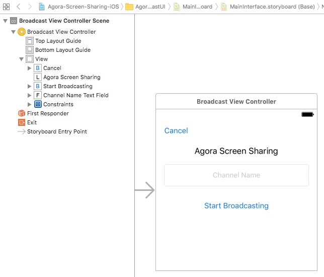
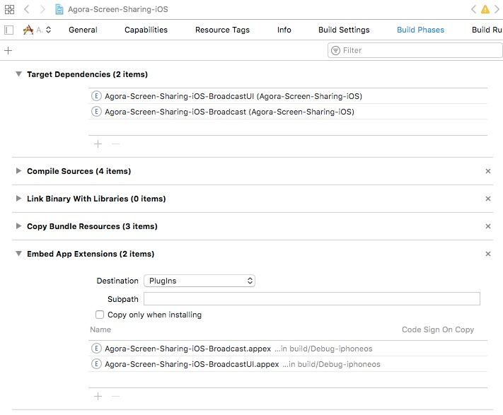
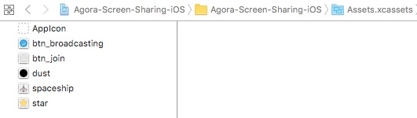

## Steps to Create the Sample 

The sample application consists of an application bundle and two app extensions. The main application bundle requires the extensions as dependencies.

- [Build the Broadcast UI Extension](#build-the-broadcast-ui-extension)
- [Build the Broadcast Extension](#build-the-broadcast-extension)
- [Build the Main Application](#build-the-main-application)


### Build the Broadcast UI Extension

- [Add Broadcast UI Frameworks and Libraries](#add-broadcast-ui-frameworks-and-libraries)
- [Create the BroadcastViewController UI](#create-the-broadcastviewcontroller-ui)
- [Create the BroadcastViewController Class](#create-the-broadcastviewcontroller-class)

#### Add Broadcast UI Frameworks and Libraries

Under the **Build Phases** tab, add the following frameworks and libraries to the Broadcast UI extension bundle:

- `ReplayKit.framework`
- `UIKit.framework`


#### Create the BroadcastViewController UI

The layout for the `BroadcastViewController` contains the following UI elements:

UI Element|Description
---|---
**Cancel**|`UIButton` to close the join screen
**Agora Screen Sharing**|`UILabel` displaying text for the application title
**Start Broadcasting**|`UIButton` to join the channel and begin broadcasting
**Channel Name**|`UITextField` for the user to enter the name of the channel




#### Create the BroadcastViewController Class

*BroadcastViewController.swift* defines and connects application functionality with the [BroadcastViewController UI](#create-the-broadcastviewcontroller-ui).

- [Define BroadcastViewController Variables and Methods](#define-broadcastviewcontroller-variables-and-methods)
- [Create BroadcastViewController Extension Methods](#create-broadcastviewcontroller-extension-methods)
- [Create the BroadcastViewController Delegate](#create-the-broadcastviewcontroller-delegate)


##### Define BroadcastViewController Variables and Methods

The `BroadcastViewController` variables and methods are contained within its `UIViewController` subclass.

``` Swift    
import ReplayKit

class BroadcastViewController: UIViewController {
	
	...
	
}
```

The `channelNameTextField` variable is an `IBOutlet` text field object that maps to the channel name field in the [BroadcastViewController UI](#create-the-broadcastviewcontroller-ui).

``` Swift    
    @IBOutlet weak var channelNameTextField: UITextField!
```

The `doCancelPressed()` method is an `IBAction` applied to the **Cancel** button in the [BroadcastViewController UI](#create-the-broadcastviewcontroller-ui). When the button is pressed, cancel the setup screen display using `userDidCancelSetup()`.

``` Swift    
    @IBAction func doCancelPressed(_ sender: UIButton) {
        userDidCancelSetup()
    }
``` 
The `doStartPressed()` method is an `IBAction` applied to the **Start Broadcasting** button in the [BroadcastViewController UI](#create-the-broadcastviewcontroller-ui). When the button is pressed, start the broadcast in the channel specified by the value of `channelNameTextField` using `userStartBroadcast()`.

``` Swift    
    @IBAction func doStartPressed(_ sender: UIButton) {
        userStartBroadcast(withChannel: channelNameTextField.text)
    }
```

##### Create BroadcastViewController Extension Methods

The `BroadcastViewController` extension methods are contained within a `private extension` declaration.

``` Swift    
private extension BroadcastViewController {
	
	...
	
}
```

The `userStartBroadcast()` method starts the broadcast setup.

1. Ensure `channel` is not empty.
2. Declare `setupInfo` with the `channelName ` information.
3. Initiate the broadcast with `setupInfo` using `extensionContext.completeRequest()`.

``` Swift    
    func userStartBroadcast(withChannel channel: String?) {
        guard let channel = channel, !channel.isEmpty else {
            return
        }
        
        let setupInfo: [String: NSCoding & NSObjectProtocol] =  [ "channelName" : channel as NSString]
        extensionContext?.completeRequest(withBroadcast: URL(string: "http://vid-130451.hls.fastweb.broadcastapp.agoraio.cn/live/\(channel)/index.m3u8")!, setupInfo: setupInfo)
    }
```

The `userDidCancelSetup()` method cancels the broadcast setup.

Retrieve the `NSError` object and submit the cancellation request using `extensionContext?.cancelRequest()`.

``` Swift    
    func userDidCancelSetup() {
        let error = NSError(domain: "io.agora.Agora-Screen-Sharing-iOS.Agora-Screen-Sharing-iOS-BroadcastUI", code: -1, userInfo: nil)
        extensionContext?.cancelRequest(withError: error)
    }
```

##### Create the BroadcastViewController Delegate

The `BroadcastViewController` class method has one `UITextFieldDelegate`.

When the `textFieldShouldReturn()` method is invoked, initiate the broadcast for the channel value `textField.text`, using `userStartBroadcast()` and return `true`.

``` Swift    
extension BroadcastViewController: UITextFieldDelegate {
    func textFieldShouldReturn(_ textField: UITextField) -> Bool {
        userStartBroadcast(withChannel: textField.text)
        return true
    }
}
```

### Build the Broadcast Extension

- [Add Broadcast Frameworks and Libraries](#add-broadcast-frameworks-and-libraries)
- [Create the AgoraUploader Class](#create-the-agorauploader-class)
- [Create the SampleHandler Class](#create-the-samplehandler-class)

#### Add Broadcast Frameworks and Libraries

Under the **Build Phases** tab, add the following frameworks and libraries to the Broadcast extension bundle:

- `AgoraRtcEngineKit.framework`
- `SystemConfiguration.framework`
- `libc++.tbd`
- `CoreMedia.framework`
- `AVFoundation.framework`
- `libresolv.tbd`
- `CoreTelephony.framework`
- `AudioToolbox.framework`
- `VideoToolbox.framework`
- `ReplayKit.framework`


#### Create the AgoraUploader Class

*AgoraUploader.swift* defines and connects application functionality with the Agora SDK.

``` Swift
import Foundation
import CoreMedia

class AgoraUploader {

	...
	
}
```

- [Define the AgoraUploader Global Variables](#define-the-agorauploader-global-variables)
- [Define the AgoraUploader Methods](#define-the-agorauploader-methods)

##### Define the AgoraUploader Global Variables

###### Video Resolution

The private `videoResolution` variable is a dynamic `CGSize` object.

Initialize `screenSize` to the current screen size using `screenSize`.

``` Swift
    private static let videoResolution : CGSize = {
        let width : CGFloat
        let height : CGFloat
        let screenSize = UIScreen.main.currentMode!.size
        
        ...
        
    }()        
```

Set the `width` and `height` values based on the device orientation and resolution below.

Orientation|Resolution|Width Value|Height Value
---|---|---|---
Portrait|High resolution|`640 * screenSize.width / screenSize.height`|`640`
Portrait|Low resolution|`360`|`360 * screenSize.height / screenSize.width`
Landscape|High resolution|`640`|`640 * screenSize.height / screenSize.width`
Landscape|Low resolution|`360 * screenSize.width / screenSize.height`|`360`

**Notes:**

- Portrait orientation is determined by the screen's `width` being less than the `height`. Otherwise, the orientation is landscape mode.
- High resolution is determined by the screen's shortest side multiplied by `16` being less than the screen's longest side multiplied by `9`. Otherwise, the resolution is considered low.

``` Swift
        if screenSize.width <= screenSize.height {
            if screenSize.width * 16 <= screenSize.height * 9 {
                width = 640 * screenSize.width / screenSize.height
                height = 640
            }
            else {
                width = 360
                height = 360 * screenSize.height / screenSize.width
            }
        }
        else {
            if screenSize.width * 9 <= screenSize.height * 16 {
                width = 360 * screenSize.width / screenSize.height
                height = 360
            }
            else {
                width = 640
                height = 640 * screenSize.height / screenSize.width
            }
        }        
```

Complete the method by returning a `CGSize` object with the `width` and `height` values.

``` Swift
        return CGSize(width: width, height: height)
```

###### Agora Engine

The private `sharedAgoraEngine` variable is a dynamic `AgoraRtcEngineKit` object.

Initialize `kit` with `KeyCenter.AppId` using `AgoraRtcEngineKit.sharedEngine()`.

Set the engine's channel profile to `.liveBroadcasting` using `kit.setChannelProfile()` and set the client role to `.broadcaster` using `kit.setClientRole()`.
 
``` Swift
    private static let sharedAgoraEngine: AgoraRtcEngineKit = {
        let kit = AgoraRtcEngineKit.sharedEngine(withAppId: KeyCenter.AppId, delegate: nil)
        kit.setChannelProfile(.liveBroadcasting)
        kit.setClientRole(.broadcaster)
        
        ...

    }()
```

Enable video using `kit.enableVideo()`.

Set the engine's external video source settings using `kit.setExternalVideoSource()` and set the video resolution and frame rate using `kit.setVideoResolution()`.

``` Swift
        kit.enableVideo()
        kit.setExternalVideoSource(true, useTexture: true, pushMode: true)
        kit.setVideoResolution(videoResolution, andFrameRate:15, bitrate:400)
```

Register `kit` for audio pre-processing using `AgoraAudioProcessing.registerAudioPreprocessing()`.

Set the audio recording parameters using `kit.setRecordingAudioFrameParametersWithSampleRate()` and set the `che.audio.external_device` parameter to `true` using `kit.setParameters()`.

``` Swift
        AgoraAudioProcessing.registerAudioPreprocessing(kit)
        kit.setRecordingAudioFrameParametersWithSampleRate(44100, channel: 1, mode: .readWrite, samplesPerCall: 1024)
        kit.setParameters("{\"che.audio.external_device\":true}")
```

Muting all video and remote audio streams using `kit.muteAllRemoteVideoStreams()` and `kit.muteAllRemoteAudioStreams()`.

Complete the method by returning `kit`.

``` Swift
        kit.muteAllRemoteVideoStreams(true)
        kit.muteAllRemoteAudioStreams(true)
        
        return kit
```

##### Define the AgoraUploader Methods

The `AgoraUploader` methods start/stop broadcasts and send video and audio buffers to the Agora engine.

###### Start or Stop Broadcast

The `startBroadcast()` method joins the user to the specified `channel` using `sharedAgoraEngine.joinChannel()`.

**Note:** A `joinSuccess` callback may be used to apply functionality after the channel join is successful.

``` Swift
    static func startBroadcast(to channel: String) {
        sharedAgoraEngine.joinChannel(byToken: nil, channelId: channel, info: nil, uid: 0, joinSuccess: nil)
    }
```

The `stopBroadcast()` method removes the user from the channel using `sharedAgoraEngine.leaveChannel()`.

``` Swift
    static func stopBroadcast() {
        sharedAgoraEngine.leaveChannel(nil)
    }
```

###### Send Video or Audio Buffer

The `sendVideoBuffer()` method pushes the video frame to the Agora engine.

1. Retrieve the video frame buffer using `CMSampleBufferGetImageBuffer()` and ensure the value is valid.
2. Retrieve the timestamp for the buffer using `CMSampleBufferGetPresentationTimeStamp()`.
3. Intialize `frame` using `AgoraVideoFrame()` and set the `format`, `time`, and `textureBuf` values.
4. Push the video frame to the Agora engine using `sharedAgoraEngine.pushExternalVideoFrame()`.

``` Swift
    static func sendVideoBuffer(_ sampleBuffer: CMSampleBuffer) {
        guard let videoFrame = CMSampleBufferGetImageBuffer(sampleBuffer)
             else {
            return
        }
        
        let time = CMSampleBufferGetPresentationTimeStamp(sampleBuffer)
        
        let frame = AgoraVideoFrame()
        frame.format = 12
        frame.time = time
        frame.textureBuf = videoFrame
        sharedAgoraEngine.pushExternalVideoFrame(frame)
    }
```

The `sendAudioAppBuffer()` method pushes the application audio to the Agora engine using `AgoraAudioProcessing.pushAudioAppBuffer()`.

``` Swift
    static func sendAudioAppBuffer(_ sampleBuffer: CMSampleBuffer) {
        AgoraAudioProcessing.pushAudioAppBuffer(sampleBuffer)
    }
```

The `sendAudioMicBuffer()` method pushes the microphone audio to the Agora engine using `AgoraAudioProcessing.pushAudioMicBuffer()`.

``` Swift
    static func sendAudioMicBuffer(_ sampleBuffer: CMSampleBuffer) {
        AgoraAudioProcessing.pushAudioMicBuffer(sampleBuffer)
    }
```

#### Create the SampleHandler Class

*SampleHandler.swift* defines and connects application functionality to the [`AgoraUploader` class](#create-the-agorauploader-class).

The `SampleHandler` methods are contained within its `RPBroadcastSampleHandler` subclass.

``` Swift
import ReplayKit

class SampleHandler: RPBroadcastSampleHandler {

	...
	
}
```

The `broadcastStarted()` method starts the broadcast. 

Check if the `channelName` for `setupInfo` is null.

- If the `channelName` is not null, start the broadcast with `channel` using `AgoraUploader.startBroadcast()`.
- If the `channelName` is null, start the broadcast with the static string `channel` using `AgoraUploader.startBroadcast()`.

``` Swift
    override func broadcastStarted(withSetupInfo setupInfo: [String : NSObject]?) {
        
        if let setupInfo = setupInfo, let channel = setupInfo["channelName"] as? String {
            //In-App Screen Capture
            AgoraUploader.startBroadcast(to: channel)
        } else {
            //iOS Screen Record and Broadcast
            AgoraUploader.startBroadcast(to: "channel")
        }
    }
```

The `broadcastFinished()` method stops the broadcast using `AgoraUploader.stopBroadcast()`.

``` Swift
    override func broadcastFinished() {
        AgoraUploader.stopBroadcast()
    }
```

The `broadcastPaused()` and `broadcastResumed()` methods are used to manage an existing broadcast stream.


``` Swift
    override func broadcastPaused() {
        // User has requested to pause the broadcast. Samples will stop being delivered.
    }
    
    override func broadcastResumed() {
        // User has requested to resume the broadcast. Samples delivery will resume.
    }
```

The `processSampleBuffer()` method processes the `sampleBuffer` for the broadcast.

Asynchronously check for the value of `sampleBufferType` using `DispatchQueue.main.async` and call the appropriate method.

Value|Method|Description
---|---|---
`RPSampleBufferType.video`|`AgoraUploader.sendVideoBuffer(sampleBuffer)`|The sample is a video buffer.
`RPSampleBufferType.audioApp`|`AgoraUploader.sendAudioAppBuffer(sampleBuffer)`|The sample is an audio buffer from the application.
`RPSampleBufferType.audioMic`|`AgoraUploader.sendAudioMicBuffer(sampleBuffer)`|The sample is an audio buffer from the microphone.

``` Swift
    override func processSampleBuffer(_ sampleBuffer: CMSampleBuffer, with sampleBufferType: RPSampleBufferType) {
        DispatchQueue.main.async {
            switch sampleBufferType {
            case RPSampleBufferType.video:
                AgoraUploader.sendVideoBuffer(sampleBuffer)
                break
            case RPSampleBufferType.audioApp:
                AgoraUploader.sendAudioAppBuffer(sampleBuffer)
                break
            case RPSampleBufferType.audioMic:
                AgoraUploader.sendAudioMicBuffer(sampleBuffer)
                break
            }
        }
    }
```

### Build the Main Application

- [Set Permissions and Add Extension Dependencies](#set-permissions-and-add-extension-dependencies)
- [Create the MainViewController UI](#create-the-mainviewcontroller-ui)
- [Create the MainViewController Class](#create-the-mainviewcontroller-class)
- [Create the GameScene Class](#create-the-gamescene-class)

#### Set Permissions and Add Extension Dependencies

Open the `info.plist` file. Enable the camera and microphone privacy settings for the application.


Under the **Build Phases** tab, add the extension dependencies to your project:

Extension|Description
---|---
`Agora-Screen-Sharing-iOS-BroadcastUI`|[Broadcast UI extension](#build-the-broadcast-ui-extension)
`Agora-Screen-Sharing-iOS-Broadcast`|[Broadcast extension](#build-the-broadcast-extension)



#### Create the MainViewController UI

Add the following assets to `Assets.xcassets`.

**Note:** Use Xcode to import assets to `Assets.xcassets`. PDF files are used for these assets, which contain images for each iOS screen resolution.



Asset|Description
------|------
`btn_join` and `btn_broadcasting`|Images of a camera to join or leave a call
`dust`|An image of a circle, representing a dust particle
`spaceship`|An image of a spaceship
`star`|An image of a yellow star

The layout for the `MainViewController` contains an `SKView` and Broadcast `UIButton` in the lower right corner of the screen.


#### Create the MainViewController Class

*MainViewController.swift* defines and connects application functionality with the [MainViewController UI](#create-the-mainviewcontroller-ui).

- [Define the MainViewController Global Variables](#define-the-mainviewcontroller-global-variables)
- [Create the MainViewController Methods](#create-the-mainviewcontroller-methods)
- [Create the MainViewController Extension Methods](#create-the-mainviewcontroller-extension-methods)
- [Create the MainViewController Delegate](#create-the-mainviewcontroller-delegate)

##### Define the MainViewController Global Variables

The `MainViewController` class has two `IBOutlet` variables and four private variables.

The `IBOutlet` variables map to the [MainViewController UI](#create-the-mainviewcontroller-ui) elements.

Variable|Description
----|----
`sceneView`|Maps to the `SKView` in the `MainViewController` layout
`broadcastButton`|Maps to the `UIButton` in the `MainViewController` layout

``` Swift
import UIKit
import SpriteKit
import ReplayKit

class MainViewController: UIViewController {

    @IBOutlet weak var sceneView: SKView!
    @IBOutlet weak var broadcastButton: UIButton!
        
    ...
}
```

Three private variables are declared as `fileprivate weak`.

Variable|Object Type|Description
---|---|---
`broadcastActivityVC`|`RPBroadcastActivityViewController`|Reference to the broadcast activity view controller
`broadcastController`|`RPBroadcastController`|Reference to the broadcast controller
`cameraPreview`|`UIView`|View to display the camera preview

``` Swift    
    fileprivate weak var broadcastActivityVC: RPBroadcastActivityViewController?
    fileprivate weak var broadcastController: RPBroadcastController?
    fileprivate weak var cameraPreview: UIView?
```

The `isBroadcasting` private variable is initialized to `false`. When the value updates, the `UIButton` image is updated using `broadcastButton?.setImage()`.

``` Swift        
    private var isBroadcasting = false {
        didSet {
            broadcastButton?.setImage(isBroadcasting ? #imageLiteral(resourceName: "btn_broadcasting") : #imageLiteral(resourceName: "btn_join"), for: .normal)
        }
    }
```

##### Create the MainViewController Methods

The `viewWillAppear()` method triggers when the view is about to render on the screen.

After invoking the superview's `viewWillAppear()` method, create a `URLSession` object and associated `dataTask` with the `https://www.agora.io` URL.

Resume the task using `dataTask.resume()`.

``` Swift    
    override func viewWillAppear(_ animated: Bool) {
        super.viewWillAppear(animated)
        
        // Used to trigger the allowing network dialog when first run, only for cellphones sold in China
        let url = URL(string: "https://www.agora.io")
        let session = URLSession(configuration: .default, delegate: nil, delegateQueue: nil)
        let dataTask = session.dataTask(with: url!)
        dataTask.resume()
    }
```

The `viewDidAppear()` method triggers when the view renders on the screen.

After invoking the superview's `viewDidAppear()` method, create a `GameScene` object and set the `scaleMode` to `.resizeFill`.

Present the `scene` in the view using `sceneView.presentScene()`.

``` Swift    
    override func viewDidAppear(_ animated: Bool) {
        super.viewDidAppear(animated)
        
        let scene = GameScene(size: sceneView.bounds.size)
        scene.scaleMode = .resizeFill
        sceneView.presentScene(scene)
    }
```

The `doBroadcastPressed()` method is triggered when `broadcastButton` is pressed.

Toggle the `isBroadcasting` value. 

If `isBroadcasting` is `true`, start broadcasting using `startReplayKitBroadcasting()`. Otherwise, stop broadcasting using `stopReplayKitBroadcasting()`.

``` Swift    
    @IBAction func doBroadcastPressed(_ sender: UIButton) {
        isBroadcasting = !isBroadcasting
        
        if isBroadcasting {
            startReplayKitBroadcasting()
        } else {
            stopReplayKitBroadcasting()
        }
    }
```

##### Create the MainViewController Extension Methods

The extension methods for `MainViewController` are contained in a separate `extension` declaration.

``` Swift    
private extension MainViewController {
	
	...
	
}
```

###### Start Screenshare

The `startReplayKitBroadcasting()` begins the broadcast or screenshare.

Ensure screensharing is available using `RPScreenRecorder.shared().isAvailable` and enable the camera and microphone using `RPScreenRecorder.shared().isCameraEnabled` and `RPScreenRecorder.shared().isMicrophoneEnabled`.

Load the broadcast activity view controller using `RPBroadcastActivityViewController.load()` display it in the view using `self.presentBroadcastActivityVC()`.

``` Swift    
    func startReplayKitBroadcasting() {
        guard RPScreenRecorder.shared().isAvailable else {
            return
        }
        
        RPScreenRecorder.shared().isCameraEnabled = true
        RPScreenRecorder.shared().isMicrophoneEnabled = true
        
        // Broadcast Pairing
        let bundleID = Bundle.main.bundleIdentifier!
        RPBroadcastActivityViewController.load(withPreferredExtension: bundleID + ".BroadcastUI") { (broadcastActivityViewController, _) in
            self.presentBroadcastActivityVC(broadcastActivityVC: broadcastActivityViewController)
        }
    }
```

###### Display Screenshare

The `presentBroadcastActivityVC()` method displays the broadcast activity view.

Ensure `broadcastActivityVC` is valid and set its `delegate` to `self`.

``` Swift    
    func presentBroadcastActivityVC(broadcastActivityVC: RPBroadcastActivityViewController?) {
        guard let broadcastActivityVC = broadcastActivityVC else {
            return
        }
        broadcastActivityVC.delegate = self
        
        ...
        
    }
```

If the device is an iPad, set the `broadcastActivityVC.modalPresentationStyle` to `.popover` as well as the following parameters for `broadcastActivityVC.popoverPresentationController`.

Parameter|Value|Description
---|---|---
`sourceView`|`broadcastButton`|Displays the popover from the broadcast button
`sourceRect`|`broadcastButton.frame`|Sets the source size to the broadcast button size
`permittedArrowDirections`|`.down`|Displays the popover in the down direction from the broadcast button


``` Swift    
        if UIDevice.current.userInterfaceIdiom == .pad {
            broadcastActivityVC.modalPresentationStyle = .popover
            broadcastActivityVC.popoverPresentationController?.sourceView = broadcastButton
            broadcastActivityVC.popoverPresentationController?.sourceRect = broadcastButton.frame
            broadcastActivityVC.popoverPresentationController?.permittedArrowDirections = .down
        }
```

Display the broadcast activity view using `present()` and update `self.broadcastActivityVC`.

``` Swift    
        present(broadcastActivityVC, animated: true, completion: nil)
        
        self.broadcastActivityVC = broadcastActivityVC
```

###### Stop Screenshare

The `stopReplayKitBroadcasting()` method stops the broadcast or screenshare.

Ensure `broadcastController` is valid and invoke `broadcastController.finishBroadcast()`.

If `cameraPreview` is valid, remove it from the superview using `cameraPreview.removeFromSuperview()`.

``` Swift    
    func stopReplayKitBroadcasting() {
        if let broadcastController = broadcastController {
            broadcastController.finishBroadcast(handler: { (error) in
                
            })
        }
        
        if let cameraPreview = cameraPreview {
            cameraPreview.removeFromSuperview()
        }
    }
```

#### Create the MainViewController Delegate

The delegate method for `MainViewController` is contained in a separate `extension` declaration.

The `broadcastActivityViewController()` method for `RPBroadcastActivityViewControllerDelegate` triggers then the activity view is finished, starting an asynchronous dispatch queue using `DispatchQueue.main.async`.

``` Swift    
extension MainViewController: RPBroadcastActivityViewControllerDelegate {

    func broadcastActivityViewController(_ broadcastActivityViewController: RPBroadcastActivityViewController, didFinishWith broadcastController: RPBroadcastController?, error: Error?) {
        DispatchQueue.main.async { [unowned self] in
        
        	...
        
        }
    }
}
```

Ensure `self.broadcastActivityVC` is valid before dismissing it using `broadcastActivityVC.dismiss()`.

``` Swift    
            if let broadcastActivityVC = self.broadcastActivityVC {
                broadcastActivityVC.dismiss(animated: true, completion: nil)
            }
```

Update `self.broadcastController` and ensure its value is valid before starting the broadcast using `broadcastController.startBroadcast()`.

If starting the broadcast generates an error, print a debug log for the `error` using `print`. Otherwise, asynchronously:

- Ensure `RPScreenRecorder.shared().cameraPreviewView` is valid.
- Update the `cameraPreview.frame`.
- Add `cameraPreview` to the view using `self.view.addSubview()`.
- Update `self.cameraPreview`.

``` Swift    
            self.broadcastController = broadcastController
            
            if let broadcastController = broadcastController {
                broadcastController.startBroadcast(handler: { (error) in
                    if let error = error {
                        print("startBroadcastWithHandler error: \(error.localizedDescription)")
                    } else {
                        DispatchQueue.main.async {
                            if let cameraPreview = RPScreenRecorder.shared().cameraPreviewView {
                                cameraPreview.frame = CGRect(x: 8, y: 28, width: 120, height: 180)
                                self.view.addSubview(cameraPreview)
                                self.cameraPreview = cameraPreview
                            }
                        }
                    }
                })
            }
```

#### Create the GameScene Class

*GameScene.swift* defines and connects application functionality applied to the `SKScene` defined the [MainViewController UI](#create-the-mainviewcontroller-ui).

- [Define the GameScene Global Methods](#define-the-gamescene-global-methods)
- [Create the GameScene Variable Methods](#create-the-gamescene-variable-methods)
- [Create the GameScene Extension Methods](#create-the-gamescene-extension-methods)

##### Define the GameScene Global Methods

The `GameScene` global methods are used to facilitate calculations for the class.

###### CGPoint Calculations

The `CGPoint` methods facilitate the following:

Method Type|Description
---|---
`+`|Adds two `CGPoint` values together
`-`|Subtracts one `CGPoint` value from another
`*`|Multiplies the values of `CGPoint` by a factor of `scalar`
`/`|Divides the values of `CGPoint` by a factor of `scalar`

``` Swift
import SpriteKit

func + (left: CGPoint, right: CGPoint) -> CGPoint {
    return CGPoint(x: left.x + right.x, y: left.y + right.y)
}

func - (left: CGPoint, right: CGPoint) -> CGPoint {
    return CGPoint(x: left.x - right.x, y: left.y - right.y)
}

func * (point: CGPoint, scalar: CGFloat) -> CGPoint {
    return CGPoint(x: point.x * scalar, y: point.y * scalar)
}

func / (point: CGPoint, scalar: CGFloat) -> CGPoint {
    return CGPoint(x: point.x / scalar, y: point.y / scalar)
}
```

###### Square-root Calculation

The `sqrt()` method calculates the square root of a `CGFloat` specified by `a`.

``` Swift
#if !(arch(x86_64) || arch(arm64))
    fileprivate func sqrt(a: CGFloat) -> CGFloat {
        return CGFloat(sqrtf(Float(a)))
    }
#endif
```

###### CGPoint Value Extensions

The `CGPoint` extension methods calculate the `length()` and `normalized()` values.

``` Swift
extension CGPoint {
    func length() -> CGFloat {
        return sqrt(x*x + y*y)
    }
    
    func normalized() -> CGPoint {
        return self / length()
    }
}
```

##### Create the GameScene Variable Methods

The `GameScene` class is a subclass of `SKScene`.

Initialize `ship` using `SKSpriteNode()` to create references to the `spaceship` image asset.

``` Swift
class GameScene: SKScene {
    
    fileprivate let ship = SKSpriteNode(imageNamed: "spaceship")
    
    ...
    
}
```

The `didMove()` method updates the objects within the `SKView`.

Set the `backgroundColor` to `SKColor.white`, update the ship's `position`, and add the `ship` to the stage using `addChild()`.

Run the dust particles animation using `run()`, which adds dust every `1` second.

``` Swift
    override func didMove(to view: SKView) {
        backgroundColor = SKColor.white
        
        ship.position = CGPoint(x: size.width * 0.5, y: size.height * 0.1)
        addChild(ship)
        
        run(SKAction.repeatForever(
            SKAction.sequence([
                SKAction.run(addDust),
                SKAction.wait(forDuration: 1.0)
            ])
        ))
    }
```

The `touchesEnded()` method triggers when the user completes a touch gesture on the screen.

Ensure `touches.first?.location` is valid before adding a star particle to the location using `fireStar()`.

``` Swift
    override func touchesEnded(_ touches: Set<UITouch>, with event: UIEvent?) {
        if let touchLocation = touches.first?.location(in: self) {
            fireStar(to: touchLocation)
        }
    }
```

##### Create the GameScene Extension Methods

The extension methods for `GameScene` are contained in a separate `extension` declaration.

``` Swift
private extension GameScene {
	
	...
	
}
```

###### Add Dust Particle

The `addDust()` method adds dust particles to the screen.

Initialize a dust particle using `SKSpriteNode()` which references the `dust` image asset.

``` Swift
    func addDust() {
        let dust = SKSpriteNode(imageNamed: "dust")
        
        ...
        
    }
```

Set `actualX` to a random value between `dust.size.width / 2` and `size.width - dust.size.width / 2` using `random()`.

Set `dust.position` to the bottom of the screen with the x position of `actualX` and set `dust.zPosition` to `-2`.

Add the `dust` particle using `addChild`.

``` Swift
        let actualX = random(min: dust.size.width / 2, max: size.width - dust.size.width / 2)
        dust.position = CGPoint(x: actualX, y: size.height + dust.size.width / 2)
        dust.zPosition = -2
        addChild(dust)
```

Set `actualDuration` to a random the value between `2` and `4` using `random()`.

Create two `SKAction` objects, then run the action sequence for the dust particle using `dust.run()`.

SKAction Object|Method|Description
---|---|---
`actionMove`|`SKAction.move(to: CGPoint(x: actualX, y: -dust.size.height / 2), duration: TimeInterval(actualDuration))`|Moves the object position
`actionMoveDone`|`SKAction.removeFromParent()`|Removes the object from its superview


``` Swift
        let actualDuration = random(min: CGFloat(2), max: CGFloat(4))
        
        let actionMove = SKAction.move(to: CGPoint(x: actualX, y: -dust.size.height / 2), duration: TimeInterval(actualDuration))
        let actionMoveDone = SKAction.removeFromParent()
        
        dust.run(SKAction.sequence([actionMove, actionMoveDone]))
```

###### Add Star Particle

The `fireStar()` method adds star particles to the screen.

Initialize a star particle using `SKSpriteNode()` which references the `star` image asset.

``` Swift
    func fireStar(to location: CGPoint) {
        let star = SKSpriteNode(imageNamed: "star")
        star.position = ship.position + CGPoint(x: 0, y: 5)
        
        ...
        
    }
```

Update `offset` by a difference of `star.position`. If `offset.y` is less than `0`, the star is off the screen, so execute a `return`.

Set `star.zPosition` to `-1` and add `star` to the stage using `addChild`.

``` Swift        
        let offset = location - star.position
        if (offset.y < 0) {
            return
        }
        star.zPosition = -1
        addChild(star)
```

Set `direction` to `offset.normalized()`, `shootAmount` to `direction * 1000`, and `realDest` to `shootAmount + star.position`.

Create three `SKAction` objects, then run the action sequence for the star particle using `star.run()`.

SKAction Object|Method|Description
---|---|---
`actionMove`|`SKAction.move(to: realDest, duration: 1.5)`|Moves the object position
`rotation`|`SKAction.rotate(byAngle: 18, duration: 1.5)`|Rotates the object
`actionMoveDone`|`SKAction.removeFromParent()`|Removes the object from its superview


``` Swift        
        let direction = offset.normalized()
        let shootAmount = direction * 1000
        let realDest = shootAmount + star.position
        
        let actionMove = SKAction.move(to: realDest, duration: 1.5)
        let rotation = SKAction.rotate(byAngle: 18, duration: 1.5)
        let actionMoveDone = SKAction.removeFromParent()
        
        star.run(SKAction.sequence([SKAction.group([actionMove, rotation]), actionMoveDone]))
```

###### Randomization Methods

The randomization extension methods for `GameScene` are contained in a separate `extension` declaration.

The `random()` method returns a single random number, where `random(min: CGFloat, max: CGFloat)` returns a random number between a minimum and maximum value.

``` Swift
private extension GameScene {
    func random() -> CGFloat {
        return CGFloat(Float(arc4random()) / 0xFFFFFFFF)
    }
    
    func random(min: CGFloat, max: CGFloat) -> CGFloat {
        return random() * (max - min) + min
    }
}

```
